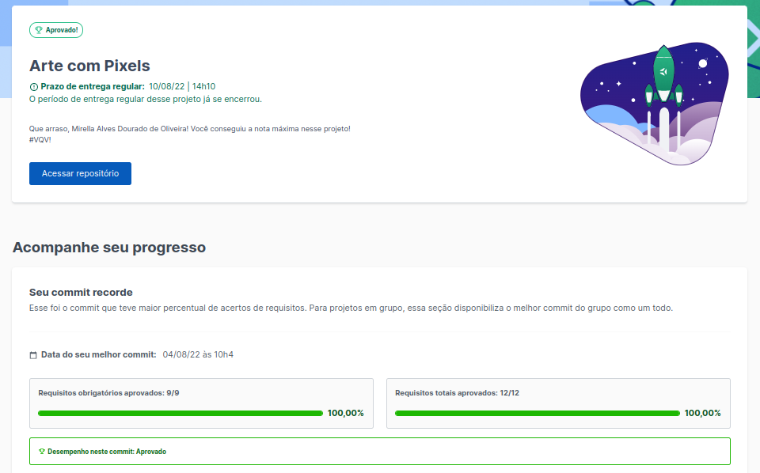

<h1> Welcome to Lessons Learned </h1>

<h2> About my project </h2>

 This is a project based on Lessons Learned. This was my first contact with HTML and CSS, there you can see about me, lessons i learned, lessons i will learn, my soft and hard skills.

This was the first project at Trybe the main focus was in HTML and a little in CSS.

  
<strong>What is Trybe? 🤷🏽‍♀️</strong>
 

  Trybe is a web development school that is genuinely committed to the professional success of those who study with them. With the Shared Success Model (SSM) offered by Trybe Fintech, a financial institution authorized to operate by the Central Bank of Brazil, students have the option of paying only when they are already working.

<h2> Project Evaluation </h2> 

 On this project my grade was 100%. It means that i did correctly all the requirements in the proposed period. 

<h2> Project Preview </h2> 

<h2>Connect with me </h2>

 For more information you can contact me: 

